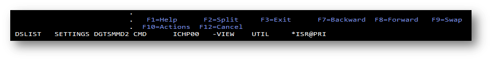
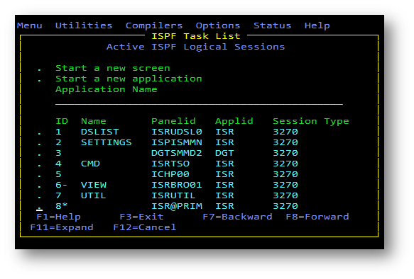
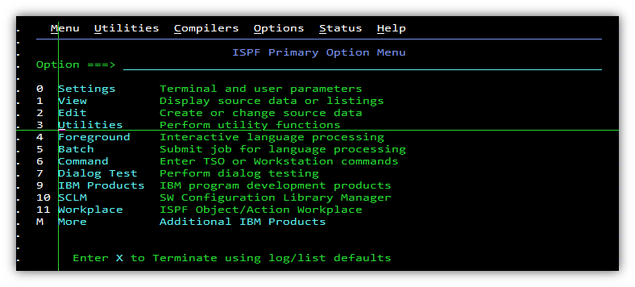
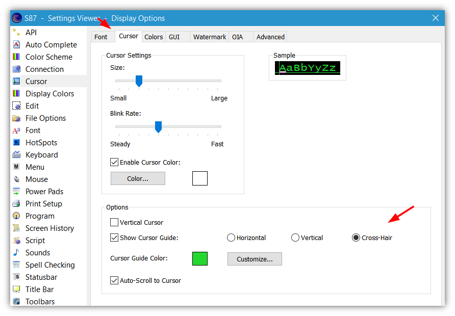

# ISPF personalization tips

## `SWAPBAR` - multi-tabs for logical screens
`SWAPBAR` will display all the active logical session names at bottom of the screen. To run, type in the command line:
```haskell
SWAPBAR ON
```


Usage tips:
* Enter `START` in any ISPF screen to start a new logical session. You can `START` up to 8 screens.
  * Entry for your current session will have an asterisk (*) at the first character’s position
* To navigate between sessions use the **PF9** key
  * You can enter the number of a specific session in the command line (for example, 3) and press **PF9**.
  * You can type `LIST` at the command line and press **PF9**. A list of sessions will be displayed. To go to a specific session, type `S` in front of it
  * All sessions are point-and-shoot. So that you can simply point your cursor to the session name which you want to pull up and then press the **Enter key**
  
* To close a logical session, enter `=X`

## Home button takes the cursor to start of command line
 1. On the PRIMARY OPTION MENU (main ISPF screen) select **Option 0 (Settings)**. 
 2. If the "**Command line at bottom**" line has a "/" in front of it, remove the "/".
 2. Here there is an option "**Tab to action bar choices**". Deselect that option.

## Pointer to cursor position


Depends on the installed emulator:
* for BlueZone


* for PComm: try pressing the **Ctrl + Home key** combination

## Built-in emulator capabilities
Emulators usually provide users with customization abilities like fonts, colors, etc. 

## Related topic
* [How to use 3270 emulators with larger screensize?](https://github.com/IBA-mainframe-dev/Global-Repository-for-Mainframe-Developers/blob/master/zOS%20System%20operating/System%20operating%20scenarios/How%20to%20use%203270%20emulators%20with%20larger%20screensize/README.MD)
