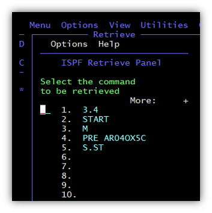

# This document contains various ISPF work scenarios

## How to set ISPF modes

1. Using ISPF 3.4 mode, in edit mode (```E```) ```‘userid.ISP.TABLES’``` delete sections ```CPPEDIT, CPPEDRT, CPPPROF, CSPEDIT, CSPPROF```

**NOTES:**
Some modes, which were set in the deleted partitions, will need to be reinstalled.

2. In the main menu:
```Option ===> 0 (null)```

3. Set the required modes in the ISPF Settings frame:

```
Options
  Enter "/" to select option
   Command line at bottom
/  Panel display CUA mode
   Long message in pop-up
   Tab to action bar choices
   Tab to point-and-shoot fields
/  Restore TEST/TRACE options
   Session Manager mode
/  Jump from leader dots
   Edit PRINTDS Command
/  Always show split line
   Enable EURO sign
```
```
Member list options
  Enter "/" to select option
  /  Scroll member list
     Allow empty member list
     Allow empty member list (nomatch)
  /  Empty member list for edit only
```

4. Press ```F3```


## How to set/cancel identification of ISPF panels

1. To display the identifiers of all ISPF panels (in the upper left corner of the screen), in the main menu:
```OPTION  ===> PANELID```

**NOTES:**
The mode is saved only until LOGON.

2. To cancel the display of identifiers of all ISPF panels (in the upper left corner of the screen), in the main menu:
```OPTION  ===> PANELID OFF```


## How to set/cancel display of functional keys

1. To set the display of function keys (at the bottom of the screen), in any frame:
```Command ===> PFSHOW ON```

2.	To cancel the display of the function keys (at the bottom of the screen), in any frame:
```Command ===> PFSHOW OFF```

**NOTES:**
In the data set ‘userid.PROOF.LIST’ (which was obtained as a result of executing the ```PROOF``` command), it is impossible to cancel the display of the function keys.


## How to assign functional keys

1. In the corresponding frame:
```Command ===> KEYS```

2. In the ```Keylist Utility``` frame, make the necessary adjustments:
```
Key       Definition                     Format  Label
F1 . . .  HELP                           SHORT   Help
F2 . . .  SPLIT                          SHORT   Split
F3 . . .  EXIT                           SHORT   Exit
F4 . . .  RETURN                         SHORT   Return
F5 . . .  RFIND                          SHORT   Rfind
F6 . . .  RCHANGE                        SHORT   Rchange
F7 . . .  UP                             SHORT   Up
F8 . . .  DOWN                           SHORT   Down
F9 . . .  SWAP                           SHORT   Swap
F10  . .  LEFT                           SHORT   Left
F11  . .  RIGHT                          SHORT   Right
F12  . .  RETRIEVE                       SHORT   Retrieve
```

3. Press ```F3```


## How to display/modify data set profile

1. To display the ```profile``` of a dataset, in a frame with any section of that dataset in edit mode (```E```):
```Command ===> PROF```

2. To change the ```profile``` of a dataset, in a frame with any section of that dataset in edit mode (```E```):

      2.1. Display the ```profile``` of a dataset:
      ```Command ===> PROF```

      As a result of executing this command, you get, for example:
      ```
      ....MODELS (FIXED - **80**)....RECOVERY **ON**....NUMBER **OFF**.............
      ....CAPS **OFF**....HEX **OFF**....NULLS **OFF**....TABS **OFF**.................
      ....AUTOSAVE **ON**....AUTONUM **OFF**....AUTOLIST **OFF**....STATS **ON**.......
      ....PROFILE **UNLOCK**....IMACRO **NONE**....PACK **OFF**....NOTE **ON**.........
      ....HILITE **BOOK** CURSOR **FIND**......................................
      ```
      2.2. If you want to change the value of any parameter to the opposite; e.g. remove section statistics     
      including id:
      ```Command ===> STATS OFF```


## ```userid``` in data sets names

1. If the dataset is not enclosed in apostrophes (```dsname```), a prefix is automatically added to the dataset name:
```userid.dsname```

2. If a dataset is enclosed in apostrophes (```‘dsname’```), the dataset name is not changed:
```dsname```

 
## How to edit ```‘userid.SUPERC.LIST’```

* Performed in data set edit mode (```E```).
* It's performed on the entire data set or in the range from ```".A"``` to ```".B"```, specified in the column with line numbers.

1. Set border on all text:
```Command ===> BOUNDS 1 133```

**NOTES:**
You can check the border by setting in the column with line numbers ```BNDS```

2. Exclude all text from being displayed (blank screen):
```Command ===> EX ALL [.A .B]```

3. Show change lines:

```Command ===> F 'I -' 2 4 ALL```

```Command ===> F 'D -' 2 4 ALL```

```Command ===> F 'RN-' 2 4 ALL```

```Command ===> F 'RO-' 2 4 ALL```

4. Remove all not displayed rows from a dataset:
```Command ===> DEL ALL X```

**NOTES:**
To remove displayed rows from a dataset:
```Command ===> DEL ALL NX```.
To restore the display of the original dataset (before it was saved):
```Command ===> RES EX```

5. Empty 8 positions can be deleted:

      5.1. Set border of movable text:
      ```Command ===> BOUNDS 7 133```

      5.2. Move text to the left by 8 positions:
      ```
      ((8
      ...
      ((
      ```

      5.3. Restore border to all text:
      ```Command ===> BOUNDS 1 133```

6. View in ```B``` mode.


## How to restore deleted data set
```
=> hlist 'USER00.work' both
=> hlist da'USER00.work' both
=> hrecover 'USER00.work' generation(0) newname('USER00.work.#031106')
```

 
## Save information about list of data sets and partitions list of data sets

1. Information about the list of data sets can be viewed by pressing ```F11``` in the frame with the list of data sets:
```
Message           Volume
Tracks %Used XT  Device
Dsorg  Recfm  Lrecl  Blksz
Tracks %   XT Device  Dsorg Recfm Lrecl Blksz  Created    Expires    Referred
         Catalog 
```

2. Information about the list of partitions in the data set can be viewed by pressing ```F11``` in the frame with the list of partitions:
```
Name     Prompt       Size   Created          Changed          ID
Name     Prompt       Size    Init     Mod      VV MM          ID
```

3. To store information about a dataset list, in a frame with a dataset list:
```Command ===> SAVE name   (any name)```

The information is stored in ```‘userid.name.DATASETS’```, 

4. To save information about a dataset partitions list:

      4.1. Specify dataset edit mode (```E```)

      4.2. In the frame with the list of sections:
      ```Command ===> SAVE name   (any name)```

      The information is stored in ‘userid.name.MEMBERS’, for example:
      ```
      #CPPSH                 01.57 05/06/13 04:24    93    92     0 USER00
      #EXPSH                 01.62 05/06/13 04:13   109   131     0 USER00
      @HFS                   01.99 05/05/30 08:04   250    29     0 USER00
      DDLIST                 01.56 05/04/11 04:34   167    93     0 USER00
      . . .
      ```


## How to save ISPF screen image in dataset ‘userid.SPFn.LIST’

1.	If there is no dataset ```‘userid.SPFn.LIST’``` (n=0-9), create it:

      1.1. In the main menu:
      ```OPTION ==> 3.2```

      1.2. In the frame ```DATA SET UTILITY```:
      ```
      OPTION ==> A
           DATA SET NAME ===> 'userid.SPFn.LIST'
      ```

      1.3. In the frame ```ALLOCATE NEW DATA SET```:
      ```
      ...
      PRIMARY QUANTITY   ===> 240
      SECONDARY QUANTITY ===> 462
      DIRECTORY BLOCKS   ===> 0
      RECORD FORMAT      ===> FBA
      RECORD LENGTH      ===> 121
      BLOCK SIZE         ===> 3146
      ```

2. Collect data by sequentially executing for each displayed screen:
```Command ===> PRINT```

3. Output prepared data to dataset ```‘userid.SPFn.LIST’```:

      3.1. In the last displayed frame after ```PRINT```:
      ```Command ===> LIST```

      3.2. In the frame ```Specify Disposition of List Data Set```:
      ```
      List Data Set (userid.SPFn.LIST) Disposition:
           Process option . . . 3
      ```

4. To output the ISPF displays image to the next dataset ```‘userid.SPFn.LIST’``` repeat steps 2 - 3.

**NOTES:**
Next dataset – ```‘userid.SPFx.LIST’:```
                              ```(x - n+1, n+2, ... 9, 0, 1, 2, ...)```

## ISPF retrieve panel

If you want to see the previous submitted command and perform one of them again, use RETP command in ISPF:



Then select a number of command. The command will be printed in command line.

## ISPF Who is command

From ISPF Primary Option Menu command: 
```
tso whois *userid*
```

For instance: `tso whois csuser`


