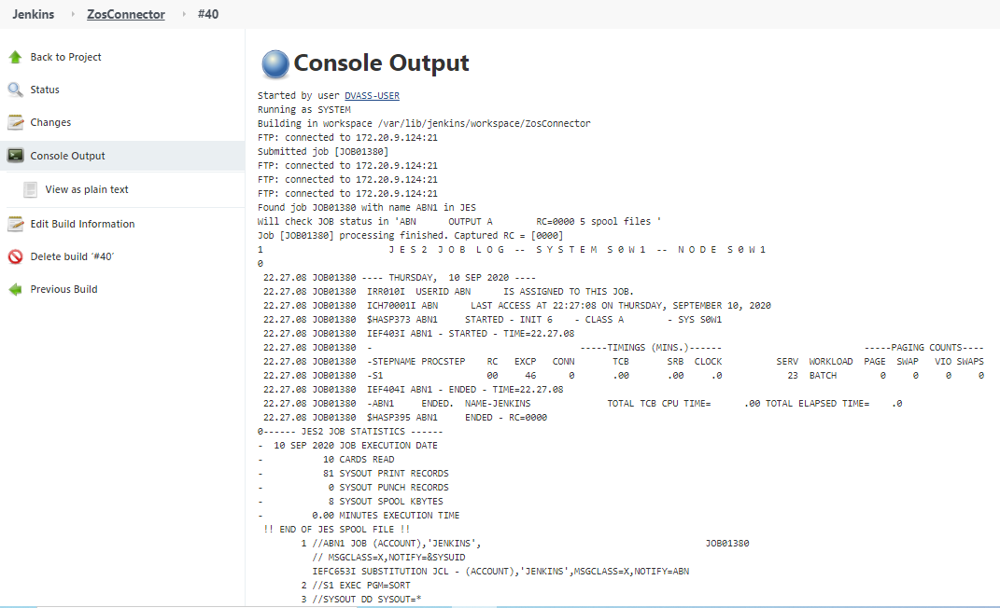

# IBM z/OS Connector Jenkins plugin

**About**

This plugin provides its functions via FTP connection to IBM z/OS LPAR. The main and most frequent function is to run JCL jobs on z/OS. Also, you can configure your SCLM project on z/OS and then check for the changes via Jenkins.

**Plugin features:**
* Submission of user JCL job (with optional log collected upon finish)
* Introduction of SCLM as SCM for your projects allowing to checkout SCLM changes
* The ability to build SCLM projects currently can be performed only via 'Submit zOS Job' build action

**Link to official z/OS Connector plugin Jenkins hub:** https://plugins.jenkins.io/zos-connector/ 

**Installation**

To install this plugin by [using our modified .hpi (source) file](https://git.icdc.io/global-repository-for-mainframe-developers/zos-system-operating/-/blob/master/Mainframe%20automation%20solutions%20and%20best%20practices/Jenkins%20plug-in%20solution%20(IBM%20zOS%20Connector)%20for%20running%20JCL%20jobs%20and%20manage%20SCLM%20on%20mainframes/zos-connector.hpi) from this repository, in Jenkins you need to switch to "Manage Jenkins" tab, then "Manage Plugins" (System Configuration) -> "Advanced" tab -> "Upload Plugin" section.

**Configuration**

`JESINTERFACELEVEL` differences.
Job Name must be configured accordingly to your FTP server configuration:

If ```JESINTERFACELEVEL=1``` is configured, only a job named ```USERIDx``` (```USERID``` - your z/OS user ID, ```x``` - strictly 1 character) can be processed correctly (when you are waiting for the job to end).
If ```JESINTERFACELEVEL=2``` is configured, no additional considerations are required.

**User guide (execution example)**

To use this plugin, you don't need to pre-configure it in "Configure System" tab (System Configuration), except ```SCLM job header``` and ```SCLM job step``` settings. 
To get started, create Jenkins Freestyle job and in ```Build``` section, choose "Submit z/OS job". 

**Note:** Be sure to check JESINTERFACELEVEL, as well as in which ftp mode (active or passive) the plugin should work to communicate with your mainframe. To enable active ftp mode, select checkbox, next to the corresponding option.

An example of filling in job fields and settings is below:


Below is an example of a successful execution of "Helloworld" job:

