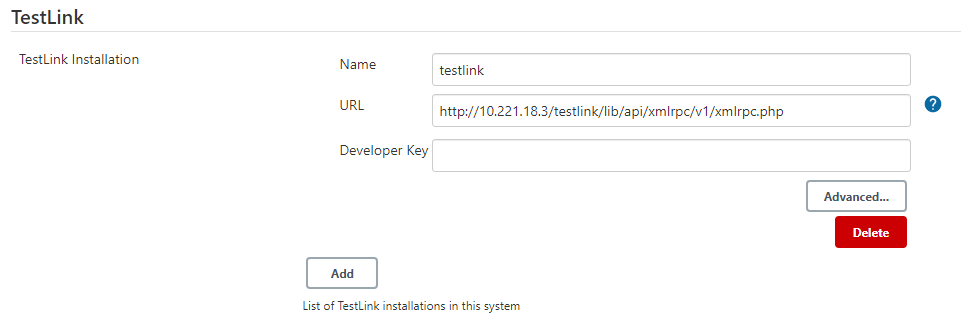
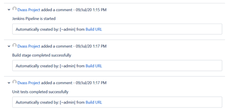

# Mainframe DevOps – How We Bring DevOps and Automation to Mainframe

Mainframe needs an update.

While mainframe continues to provide a lot of value to many different organizations, some of its elements remain stuck in the past and are still performed sub-optimally.

For example — mainframe software development is still very inefficient. It’s complicated, it’s high-effort, and it includes many time-consuming steps that reduce productivity.  

Thankfully, it doesn’t have to be this way.

Mainframe software development can be updated with a more modern approach, and we wrote this article to share how we implement DevOps tools, processes, and best practices to automate every stage of mainframe software development.

We will show you:
* Our vision for a mainframe DevOps workflow, including which processes and components we use. We will explain how to use them individually or in combination to either implement our vision as-is within your local environment, or to test, customize, and combine them with your existing workflows.
* How modern Continuous Integration/Continuous Delivery (CI/CD) tools can be applied to mainframe to create automated analysis, build, test, run, and deployment of z/OS applications within a CI/CD pipeline.
* How we introduce a universal and flexible pipeline solution for a wide range of z/OS-based applications to provide a full range of CI/CD processes for mainframe teams and processes that currently utilize minimal or no automation.

Overall, we will present our approach with as much flexibility as possible, to make sure you can implement some of it no matter how specific or unique your context might be.

And to give you a comprehensive approach to mainframe DevOps, we will try to cover as many of the stages within the common DevOps “infinity sight” framework as possible.

<p align="center">

</p>

## Table of Contents: How to Bring DevOps and Automation to Mainframe
* [**Code**](#code)
  * [How to Use ZIGI ISPF Git Interface and Git for z/OS to Bring “One Push Button” to Mainframe](#how-to-use-zigi-ispf-git-interface-and-git-for-zos-to-bring-one-push-button-to-mainframe)
* [**Build Deployment Release**](#build-deployment-release)
  * [IBM z/OS Connector Jenkins plugin](#ibm-zos-connector-jenkins-plugin)
  * [Shell scripts](#shell-scripts)
  * [Automated PTF building using REXX script](#automated-ptf-building-using-rexx-script)
  * [Jenkins - pipeline creation and execution](#jenkins---pipeline-creation-and-execution)
* [**Test**](#test)
	* [How to Use Jira and GitLab for z/OS Test Automation and TestLink Test Management System Integration](#how-to-use-jira-and-gitlab-for-zos-test-automation-and-testlink-test-management-system-integration)
	* [SonarQube Enterprise - code analysis and quality gate](#sonarqube-enterprise---code-analysis-and-quality-gate)
* [**Deploy**](#deploy)
	* [Automated SMP/E installation and management](#automated-smpe-installation-and-management)
* [**Operate**](#operate)
* [**Plan and Monitor**](#plan-and-monitor)
	* [Integrating Jira into the Jenkins pipeline’s processes — like tracking issues and statuses, and managing documents — and into test management systems — like tracking deployment status, and automatically generating reports](#integrating-jira-into-the-jenkins-pipelines-processes--like-tracking-issues-and-statuses-and-managing-documents--and-into-test-management-systems--like-tracking-deployment-status-and-automatically-generating-reports)

Our solution is built around the “One Push Button” concept. In this concept, developers will only have to take a single action to start the pipeline, and the pipeline will then perform all other steps automatically, and move new code to production without any additional manual intervention.

This approach is fully customizable, and uses the following components and tools. (We have underlined the freeware tools.)
1. [ZIGI ISPF Git interface + Git for z/OS](https://github.com/IBA-mainframe-dev/Global-Repository-for-Mainframe-Developers/tree/master/zOS%20System%20operating/Mainframe%20automation%20solutions%20and%20best%20practices/Zigi)
2. [REXX scripts](https://github.com/IBA-mainframe-dev/Global-Repository-for-Mainframe-Developers/tree/master/zOS%20System%20operating/REXX%20Scripts)
3. [Automated SMP/E installation and management](https://github.com/IBA-mainframe-dev/Global-Repository-for-Mainframe-Developers/tree/master/zOS%20System%20operating/SMPe)
4. [JCL jobs for various automation ](https://github.com/IBA-mainframe-dev/Global-Repository-for-Mainframe-Developers/tree/master/zOS%20System%20operating/Batch%20jobs%20(JCLs))
5. [Jenkins - pipeline creation and execution](https://github.com/IBA-mainframe-dev/Global-Repository-for-Mainframe-Developers/tree/master/zOS%20System%20operating/Mainframe%20automation%20solutions%20and%20best%20practices/Jenkins%20plug-in%20solution%20for%20running%20JCL%20jobs%20on%20mainframes)
6. [TestLink integration with Jenkins pipeline](#how-to-use-jira-and-gitlab-for-zos-test-automation-and-testlink-test-management-system-integration)
7. [JIRA - issues, statuses and document management](https://github.com/IBA-mainframe-dev/Global-Repository-for-Mainframe-Developers/tree/master/zOS%20System%20operating/Mainframe%20automation%20solutions%20and%20best%20practices/Jira)
8. [SonarQube Enterprise - code analysis and quality gate](https://github.com/IBA-mainframe-dev/Global-Repository-for-Mainframe-Developers/tree/master/zOS%20System%20operating/Mainframe%20automation%20solutions%20and%20best%20practices/SonarQube)

All of the tools used in our example are open-source, and any stage of the automation process can be called from Jenkins. We’ve found two options to integrate Jenkins with mainframe:
- [IBM z/OS Connector Jenkins plugin](https://github.com/IBA-mainframe-dev/Global-Repository-for-Mainframe-Developers/wiki/Jenkins-plug-in-solution-(IBM-z-OS-Connector)-for-running-JCL-jobs-and-manage-SCLM-on-mainframes)
- Automated Shell scripts working through FTP
	
# Code

## How to Use ZIGI ISPF Git Interface and Git for z/OS to Bring “One Push Button” to Mainframe

<p align="center">

</p>

We use Git for z/OS and the ZIGI ISPF interface to create a “One Push Button” pipeline in mainframe, and to rapidly deliver code changes and fixes to production. Together, they create a convenient format to work with Git right on the mainframe in the 3270 session.

To implement this solution, you first must install Git for z/OS on your system.

Here’s how.

**Installation**

Here’s a quick guide to install Git onto z/OS. (You can find detailed information about the product and how to install it at: https://my.rocketsoftware.com/)

**<ins>Prerequisite software</ins>**
* **z/OS 2.3 or higher**: Required for Git 2.26.2 for z/OS.
* **z/OS Miniconda**: Git 2.26.2 for z/OS (and all Rocket z/OS tool and language ports) are installed via conda, so you need conda already installed on your system. z/OS Miniconda contains everything you need to install and run conda.
	
To download and install z/OS Miniconda from the Rocket Community Portal:
1. Sign in to the Rocket Community Portal.
[https://my.rocketsoftware.com/RocketCommunity](https://my.rocketsoftware.com/RocketCommunity)
2. Click Downloads from the navigation menu. A list of available Rocket products for your account appears.
3. Select z/OpenSource.
4. Type 'Miniconda' in the search box to filter the list of available downloads.
5. Click the filtered ID number. A dialog window appears with the files that are required for setup.
6. Click each file to download them to your system.
7. Using a FTP or SFTP client transfer the setup files to z/OS:
	* miniconda-zos-<X.Y>-.run
	* appdev_manifest-<X.Y>.txt

*Note:* If you have a multi-user environment you shouldn’t give your end users write access to the Miniconda installation directory. Instead, create a dedicated z/OS user to install and configure Miniconda. This Miniconda administrator won’t require any special permission nor superuser access.

To install Miniconda on z/OS, complete the following steps:
1. Login to your z/OS system using ssh client (e.g. PuTTy) and change directory to the path where you saved Miniconda installation files.
2. Set tags for these files:
```
chmod +x miniconda-zos-<X.Y>-<yyyy-mm-dd>.run 
chtag -tc 819 appdev_manifest-<X.Y>.txt
```
3. Set following environment variables to be able to run the install script:
```
export _BPXK_AUTOCVT=ON 
export _CEE_RUNOPTS='FILETAG(AUTOCVT,AUTOTAG) POSIX(ON)'
```
4. Execute the self-extracting installer at the prompt:
```
./miniconda-zos-<X.Y>-<yyyy-mm-dd>.run --path <miniconda_installation_path>
```
5. Confirm installation directory and conda channel server configuration in the interactive installation

**Installing Git via conda:**
```
conda install -c <channel> git
```

**Here is the Git for z/OS sources, installation instructions and documentation:** [https://www.rocketsoftware.com/platforms/ibm-z/git-for-zos](https://www.rocketsoftware.com/platforms/ibm-z/git-for-zos)

**Here is a separate article about ZIGI ISPF interface installation and usage:** [https://github.com/IBA-mainframe-dev/Global-Repository-for-Mainframe-Developers/blob/master/zOS%20System%20operating/Mainframe%20automation%20solutions%20and%20best%20practices/Zigi/README.md](https://github.com/IBA-mainframe-dev/Global-Repository-for-Mainframe-Developers/blob/master/zOS%20System%20operating/Mainframe%20automation%20solutions%20and%20best%20practices/Zigi/README.md)

[**Back to table of contents**](#table-of-contents-how-to-bring-devops-and-automation-to-mainframe)

# Build Deployment Release

When we say “Build”, we mean starting with source files produced by developers, and ending with things like installation packages that are ready for deployment.

To build code on the mainframe, you must run various jobs. To do so with DevOps, you need to perform a remote call to a job on the mainframe.

There are a few ways you can do this.

## IBM z/OS Connector Jenkins plugin

This plugin uses an FTP connection to IBM z/OS LPAR. Most often, it is used to run JCL jobs on z/OS, but you can also configure your SCLM project on z/OS and then check for the changes via Jenkins.  

**Here’s the official z/OS Connector plugin Jenkins hub:** [https://plugins.jenkins.io/zos-connector/](https://plugins.jenkins.io/zos-connector/)

**Installation**

To install this plugin, use our modified .hpi (source) file. With it, you will open Jenkins and then switch to the "Manage Jenkins" tab, then to "Manage Plugins" (System Configuration) -> "Advanced" tab -> "Upload Plugin" section.

**Here’s configuration steps and other information about the z/OS Connector:**
[https://github.com/IBA-mainframe-dev/Global-Repository-for-Mainframe-Developers/wiki/Jenkins-plug-in-solution-(IBM-z-OS-Connector)-for-running-JCL-jobs-and-manage-SCLM-on-mainframes](https://github.com/IBA-mainframe-dev/Global-Repository-for-Mainframe-Developers/wiki/Jenkins-plug-in-solution-(IBM-z-OS-Connector)-for-running-JCL-jobs-and-manage-SCLM-on-mainframes)

## Shell Scripts

You can also use Shell script to run JCL jobs on the mainframe via FTP.

Execution format:
```
>./sendChangedSrc.sh [HLQ] [restore]
```
Where
* `[HLQ]` - datasets qualifiers, required parameter
* `[restore]` - constant value which must be specified to restore changed modules from master branch in case of errors

The script will return 1 if HLQ was not specified, if the changed modules list is empty, or if the file transfer was unsuccessful.

**Here is an example of this script:**
[https://github.com/IBA-mainframe-dev/Global-Repository-for-Mainframe-Developers/wiki/Shell-script-for-transferring-changed-sources-in-git-to-the-mainframe-via-ftp](https://github.com/IBA-mainframe-dev/Global-Repository-for-Mainframe-Developers/wiki/Shell-script-for-transferring-changed-sources-in-git-to-the-mainframe-via-ftp)

You can also group regularly repeated z/OS actions into one JCL job that can be executed on the mainframe from the pipeline via FTP. We often use this approach to prepare our environment to test code on another mainframe.

Below, we have prepared JCL scripts to automate the actions we need to perform on the mainframe. (These steps are part of our fully automated pipeline.)

Here are available automated options that we use in our pipeline example:

## Automated PTF building using REXX script

You can also automate some repetitive parts of code development for mainframe by writing REXX scripts, and using them in JCLs are part of the pipeline. In our case, we save time and eliminate careless mistakes by automating the process of building the PTF dataset.

**Here’s our REXX script template:**
[https://github.com/IBA-mainframe-dev/Global-Repository-for-Mainframe-Developers/wiki/REXX-script-for-buillding-PTF](https://github.com/IBA-mainframe-dev/Global-Repository-for-Mainframe-Developers/wiki/REXX-script-for-buillding-PTF)

[**Back to table of contents**](#table-of-contents-how-to-bring-devops-and-automation-to-mainframe)

# Test

## How to Use Jira and GitLab for z/OS Test Automation and TestLink Test Management System Integration

Code testing is an important step in the development cycle. You must make sure that your old functionality works without changes, and that your new functionality works as intended.

To do so, you must write test descriptions as test cases. You then need to store them somewhere that’s easy to monitor, that makes it easy to generate reports, and that collects all required functionality in one place.

There are many test management systems (TMS), including TestLink, TestRail, and BugZilla. We prefer TestLink for test automation because it has a good API that lets you integrate with a wide range of other software.

<p align="center">

</p>

TestLink is a freeware TMS that drives software quality assurance. With it, you can manage different test-related artifacts — like cases, suites, plans, and builds — and you can run execution reports and statistics through a web browed user interface.

TestLink gives you:
* User roles and management.
* Grouping of test cases in test specifications, making test plans.
* Requirements with versioning and revisioning.
* Customization of the user interface using Smarty templates.
* Integration with LDAP.

We install TestLink on a separate virtual Ubuntu server.

You can download TestLink from these links. You can learn how to install TestLink within its official documentation, and within its GitHub .readme file.

**Testlink source files:**  [https://sourceforge.net/projects/testlink/files/latest/download?source=files](https://sourceforge.net/projects/testlink/files/latest/download?source=files)

**Testlink GitHub:** [https://github.com/TestLinkOpenSourceTRMS/testlink-code](https://github.com/TestLinkOpenSourceTRMS/testlink-code)

*Note:* TestLink’s installation scripts are not fully automated and require some manual tweaking. Because of this you have to be careful when installing TestLink, especially in the output logs and messages. After you install TestLink, its GUI may contain bugs and artifacts, some of which are caused by bugs in TestLink’s source code. If you encounter problems during installation, or if the installed program is behaving incorrectly, then contact us and we will be happy to help you. Just open a GitHub issue on the relevant topic, or write to us, and we’ll address your problems as soon as possible.  

**GRMD GitHub Issues:** [https://github.com/IBA-mainframe-dev/Global-Repository-for-Mainframe-Developers/issues](https://github.com/IBA-mainframe-dev/Global-Repository-for-Mainframe-Developers/issues)

**Email for direct communication:** grmd@ibagroup.eu

We use the Jenkins plugin to link TestLink to our DevOps pipeline. This lets you associate automated tests with test cases, and to include clear descriptions and a list of steps, to set statuses, and to attach test logs and their results. This simplifies the work for testers and consolidates tests and test cases in one place.

After you install TestLink on your server, you must install the TestLink plugin.

**Here’s the Testlink Jenkins plugin:** [https://plugins.jenkins.io/testlink/](https://plugins.jenkins.io/testlink/)

*Note:* Remember that this plugin is open source (https://github.com/jenkinsci/testlink-plugin) and can be easily modified to suit your needs.

<p align="center">

</p>

Where
* URL - your local Testlink URL
* Developer Key - Personal API access key which should be generated on the user “My Settings” page with appropriate field - API interface (Personal API access key)

#### How to Link a Specific Test Case to a Specific Test in GitLab

To connect a test case in TestLink with a corresponding test class in Git, you first must add a new custom field.

<p align="center">

</p>

Then, you must put the Git test class name into this field.

<p align="center">

</p>

<p align="center">

</p>
 
Finally, you must setup the Jenkins TestLink plugin as we previously described. You will now be able to execute tests from Jenkins, and your test results — as well as any JIRA bug issues opened for the failed tests — will automatically be added to the corresponding test execution records.

To review them, just click on the gamepad icon on the top panel (“Test Execution”) and select the appropriate test build number or name.

<p align="center">

</p>

[**Back to table of contents**](#table-of-contents-how-to-bring-devops-and-automation-to-mainframe)

## SonarQube Enterprise - Code Analysis and Quality Gate

<p align="center">

</p>

SonarQube is an industry-leading tool for code analysis that automatically finds and corrects logical, security, and vulnerability issues in source code. It supports PL/I and COBOL and integrates well into mainframe CI/CD processes.

SonarQube has two parts —a Scanner and a Server — and both should be installed on the machine that’s running your pipeline. The Scanner can be called with Jenkins or Azure, and once it completes its scan it passes the results to the Server. From there, you can continue the pipeline operation or stop it, depending on the Scanner’s results.

You can find more information at [https://www.sonarqube.org/](https://www.sonarqube.org/)

Here’s SonarQube’s latest documentation: [https://docs.sonarqube.org/latest/](https://docs.sonarqube.org/latest/)

And here’s a guide to try out the product: [https://docs.sonarqube.org/latest/setup/get-started-2-minutes/](https://docs.sonarqube.org/latest/setup/get-started-2-minutes/)

**How to install a local instance of SonarQube from the zip file (Community Edition)**

1. Download zip file from the official site.
2. As a non-root user, unzip it.
3. As a non-root user, start the server:
* \*\**binwindows-x86-64StartSonar.bat* - **for Windows**
* \*\**bin[Your OS]sonar.sh* (console) - **for others OS**
4. Log in to http://localhost:9000 using System Administrator credentials:
```
            login:      admin 
            password:   admin
```

**Here’s a trial for analyzing the project (Community Edition)**

1. Click the Create new project button.
2. Give your project a Project key and a Display name, and click the Set Up button.
3. Under Provide a token, select Generate a token. Give your token a name, click the Generate button, and click Continue.
4. Select your project's main language under Run analysis on your project, and follow the instructions to analyze your project. Here you'll download and execute a Scanner on your code (if you're using Maven or Gradle, the Scanner is automatically downloaded).

**Here's SonarQube’s full installation guide:**
[https://docs.sonarqube.org/latest/setup/install-server/](https://docs.sonarqube.org/latest/setup/install-server/)

**Here’s a separate article about SonarQube installation and usage:** (link)

[**Back to table of contents**](#table-of-contents-how-to-bring-devops-and-automation-to-mainframe)

# Deploy

When we talk about “Deploy”, we include every step, process, and activity needed to make a software system or update available for its intended users. Like with Build, this require running a wide range of jobs. Here are a few examples.

## Automated SMP/E installation and management

<p align="center">

</p>

You don’t need to manually install the new PTF into SMP/E. Instead, you can call JCL jobs to RECEIVE/APPLY/ACCEPT PTF directly from CI/CD pipeline. If there is any failure, you can perform automatic rollbacks by calling REJECT/RESTORE JCLs.

Here’s a list of JCL scripts and templates we use to automate work with SMP/E:
1. [JCL job for loading PTF information into global zone and SMPe datasets](https://github.com/IBA-mainframe-dev/Global-Repository-for-Mainframe-Developers/wiki/JCL-job-for-loading-PTF-information-into-global-zone-and-SMPe-datasets)
2. [JCL job for installing PTF in the SMPe target libraries](https://github.com/IBA-mainframe-dev/Global-Repository-for-Mainframe-Developers/wiki/JCL-job-for-installing-PTF-in-the-SMPe-target-libraries)
3. [JCL job for installing PTF in the SMPe distribution libraries](https://github.com/IBA-mainframe-dev/Global-Repository-for-Mainframe-Developers/wiki/JCL-job-for-installing-PTF-in-the-SMPe-distribution-libraries)
4. [JCL job for rejecting PTF to clean up the global zone](https://github.com/IBA-mainframe-dev/Global-Repository-for-Mainframe-Developers/wiki/JCL-job-for-rejecting-PTF-to-clean-up-the-global-zone)
5. [JCL job for restoring PTF to clean up the target zone](https://github.com/IBA-mainframe-dev/Global-Repository-for-Mainframe-Developers/wiki/JCL-job-for-restoring-PTF-to-clean-up-the-target-zone)
6. [JCL job for creating SMPe zones environment and user datasets](https://github.com/IBA-mainframe-dev/Global-Repository-for-Mainframe-Developers/wiki/JCL-job-for-creating-SMPe-zones-environment-and-user-datasets)
7. [JCL job for customizing SMPe distribution zone environment](https://github.com/IBA-mainframe-dev/Global-Repository-for-Mainframe-Developers/wiki/JCL-job-for-customizing-SMPe-distribution-zone-environment)
8. [JCL job for customizing SMPe global zone environment](https://github.com/IBA-mainframe-dev/Global-Repository-for-Mainframe-Developers/wiki/JCL-job-for-customizing-SMPe-global-zone-environment)
9. [JCL job for customizing SMPe target zone environment](https://github.com/IBA-mainframe-dev/Global-Repository-for-Mainframe-Developers/wiki/JCL-job-for-customizing-SMPe-target-zone-environment)

[**Back to table of contents**](#table-of-contents-how-to-bring-devops-and-automation-to-mainframe)

## Operate

Operational tasks include running a wide range of jobs on mainframe. These include:
* Helping QA create conditions for stress tests and load testing.
* Transferring code to production.
* Transferring files from one system to another.
* Any other manual operation that can be included in the pipeline and automated.

For example: After deploying an application you may need to transfer a file that is being kept by the customer on Windows onto the mainframe where it will be used. To automate this process, you can use the following script:

* [How to transfer file from Windows to zOS with command line ftp?](https://github.com/IBA-mainframe-dev/Global-Repository-for-Mainframe-Developers/wiki/How-to-transfer-file-from-Windows-to-zOS-with-command-line-ftp%3F)

You can call this job from Jenkins and include it in your general pipeline.

Here are a few more scripts that automate operational tasks and add them to the DevOps pipeline.
- [Shell script for datasets to transfer from UNIX to the mainframe via ftp](https://github.com/IBA-mainframe-dev/Global-Repository-for-Mainframe-Developers/wiki/Shell-script-for-datasets-transfering-from-UNIX-to-the-mainframe-via-ftp)
- [Shell script to run JCL jobs on the mainframe via ftp](https://github.com/IBA-mainframe-dev/Global-Repository-for-Mainframe-Developers/wiki/Shell-script-for-running-JCL-jobs-on-the-mainframe-via-ftp)
- [Shell script to transfer changed sources in git to the mainframe via ftp](https://github.com/IBA-mainframe-dev/Global-Repository-for-Mainframe-Developers/wiki/Shell-script-for-transferring-changed-sources-in-git-to-the-mainframe-via-ftp)
- [How do I copy data sets to other LPAR?](https://github.com/IBA-mainframe-dev/Global-Repository-for-Mainframe-Developers/wiki/How-to-copy-data-sets-to-other-LPAR)

[**Back to table of contents**](#table-of-contents-how-to-bring-devops-and-automation-to-mainframe)

# Plan and Monitor

With Planning and Monitoring, teams can quickly and automatically respond to degradation in the customer experience, and implement the product. A bug tracking system can help with this.

## Integrating Jira into the Jenkins pipeline’s processes — like tracking issues and statuses, and managing documents — and into test management systems — like tracking deployment status, and automatically generating reports

<p align="center">

</p>

JIRA is a common choice for project management and bug tracking, and it includes a range of useful features. These include:
* Task tracking.
* Decorating pipeline execution.
* Interaction with other tools via REST API.

You can automate all of these features into the software development process by integrating JIRA with your Jenkins pipeline and test management tools. You can integrate JIRA with these tools using Jenkins plugins or REST API-based scripts.

Here’s how we integrate Jira with our Jenkins pipeline and test management tools.
1. In Jira we create a ticket with the task’s description, assignee, priority and other necessary fields for the development of a new functionality or software module.
2. The developer starts working on the task.
3. When the new functionality is ready, and when the developer is ready to start a merge request to the required branch, the ZIGI ISPF interface will automatically issue the merge request on the mainframe with a Jira ticket name. This will also trigger the launch of the entire Jenkins pipeline.
4. The Jenkins pipeline then converts the ticket status to “In Progress” (or any other custom status) and the magic begins :).
5. In Jira — during the work of the pipeline — comments are added for each step of the pipeline, whether it is successful or not. This lets us track the status of the deployment and its history directly from JIRA.
6. During testing, we also add test results to the ticket in the form of .xml files or any others.
7. When the pipeline completes its execution, the ticket is set to the “Done” status. If the pipeline execution was interrupted or terminated with an error, it is set to the “To Do” status with slack and email notification.

For example, let’s look at this integration using the simplest and most functional Jenkins plugins. As an alternative to the plugin, you can use a set of REST-based, easy-to-customize shell scripts. Here are a few examples of these scripts, including instructions.
* [How to add comments to the Jira ticket](https://github.com/IBA-mainframe-dev/Global-Repository-for-Mainframe-Developers/wiki/Shell-script-to-add-a-comment-to-a-Jira-issue)
* [How to attach files to the Jira ticket](https://github.com/IBA-mainframe-dev/Global-Repository-for-Mainframe-Developers/wiki/Shell-script-to-add-a-file-to-the-attachment-area-of-a-Jira-issue)
* [How to change of statuses in Jira ticket](https://github.com/IBA-mainframe-dev/Global-Repository-for-Mainframe-Developers/wiki/Shell-script-to-change-a-Jira-ticket-status)
* [How to track Jira ticket status (trigger desired action after ticket status change)](https://github.com/IBA-mainframe-dev/Global-Repository-for-Mainframe-Developers/wiki/Shell-script-to-track-Jira-ticket-status)

Here are our most-used Jenkins Jira Plugins. Some have similar functionality , including a few differences that are necessary in some cases:

1. Jira plugin - https://plugins.jenkins.io/Jira/
2. Jira Pipeline Steps - https://plugins.jenkins.io/Jira-steps/
3. JiraTestResultReporter - https://github.com/IBA-mainframe-dev/Global-Repository-for-Mainframe-Developers/wiki/Shell-script-to-track-Jira-ticket-status


*Note:* All of these plugins are open-source, and you can use them to build custom hpi modules that better fit your unique tasks and requirements.

To set up your plugins, and to connect them to your Jira instance, you will use the Jenkins System Configuration.

Here are Jenkins pipeline code examples (declarative syntax):

**Сhange Jira ticket status from ‘TO DO’ to ‘IN PROGRESS’**

Here, you can determine the ID of each status — including the custom one —by selecting statuses and viewing the html code of the Jira ticket page. IDs differ between Jira instances, including for standard statuses, so this is the fastest way to find them.

<p align="center">

</p>

They don’t change, so you can save them in advance:
```
def transitionToDo = [ transition: [ id: '11' ] ]
def transitionInProgress = [ transition: [ id: '21' ] ]
def transitionDone = [ transition: [ id: '31'] ]
```
1. Jira ticket status transfer example:
```
JiraTransitionIssue idOrKey: "${JiraID}", input: transitionInProgress, site: "${JiraSite}"
```
Where
* `${JiraID}` - your Jira ticket ID (like “'DVSS-19'”)
* `${JiraSite}` - your Jira location name (from Jira System Configuration)

2. Add comments to the Jira ticket
```
JiraAddComment idOrKey: "${JiraID}", comment: 'Jenkins Pipeline is started', site: "${JiraSite}"
```
<p align="center">

</p>

3. Test failure - open new bug ticket, example:
4. Upload attachment to the Jira ticket attachments
```
JiraUploadAttachment idOrKey: "${JiraID}", site: "${JiraSite}", file: 'changesList.txt'
```
Where
* `${JiraID}` - your Jira ticket ID (like “'DVSS-19'”)
* `${JiraSite}` - your Jira location name (from Jira System Configuration)
* **file:** - name of your attachment file

[**Back to table of contents**](#table-of-contents-how-to-bring-devops-and-automation-to-mainframe)