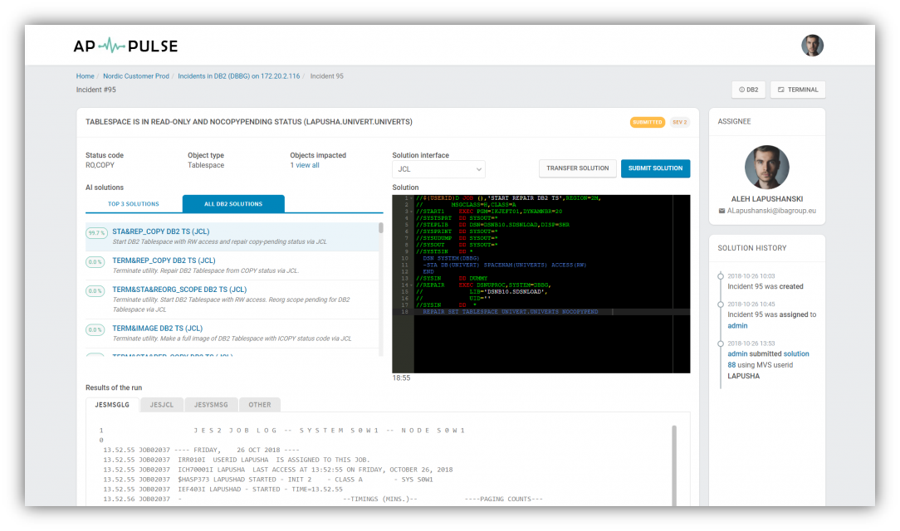

# Mainframe troubleshooting platform - APPULSE

**APPULSE** is a centralized support platform for business applications that run on z/OS servers. Designed for Level
1 and Level 2 support, APPULSE provides uninterrupted operation of critical business applications, resulting from
proactive problem identification and resolution.

[Link to official APPULSE page](https://appulse.info/)

**Using APPULSE, you can:**
* Digitize, accumulate, and share experience of your support team
* Monitor distributed business applications from one entry point
* Reuse previous solutions to resolve similar problems
* Identify and classify operational problems in business applications at an early stage
* Automatically create and assign tickets on problems for relevant support
* Assess how a problem may impact your business

**APPULSE provides the implementation of the following features:**
* Centralized support platform for users (L1/L2 Support), business applications, z/OS servers, LPARs, and
subsystems
* Flexibly configurable monitoring for operational problems in critical z/OS subsystems, including IMS, CI
DB2, MQ, TWSz, and NetView FTP
* Problem management, including
    * Automatic creation and assignment (Jira, Redmine, RTC, Gitlab, and Youtrack)
    * Mail and messenger notification (Slack, Telegram, and Viber)
    * Chat creation (Slack and Sametime)
    * Constant status feedback and prioritizing
* AI module for solution generation with an option to execute on z/OS server
* Business impact information
* Easy mainframe business application support without using 3270 session

