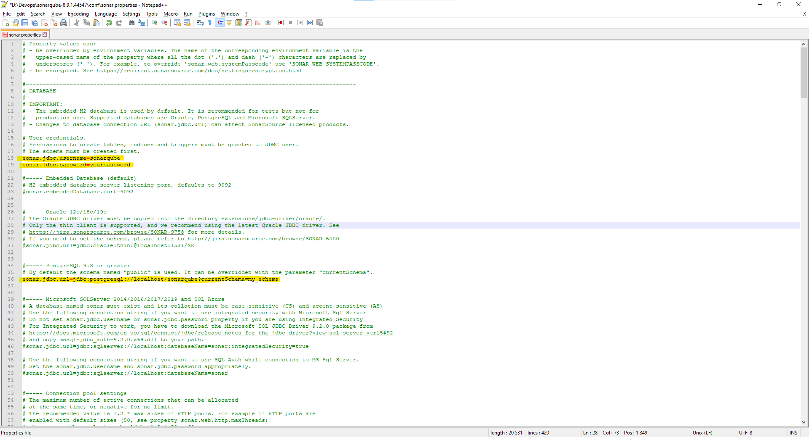

# SonarQube

## Installation from the ZIP file

There are 2 ways to install SonarQube: from the Docker image or from the ZIP file. Down below example of installation from the ZIP file.

The only prerequisite for running SonarQube is to have Java (Oracle JRE 11 or OpenJDK 11) installed on your machine.

1.  Download

    Download and unzip [distribution](https://www.sonarqube.org/downloads/) from the official site.
    Do not unzip into a directory starting with a digit.
    SonarQube cannot be run as root on Unix-based systems, so you can create a dedicated user account for SonarQube.
    $SONARQUBE-HOME (below) refers to the path to the directory where the SonarQube distribution has been unzipped.

2.  Setting the access to the database.

    SonarQube supports several database platforms, you can check the latest list at the [offical page](https://docs.sonarqube.org/latest/requirements/requirements/).

    To configure database settings edit $SONARQUBE-HOME/conf/sonar.properties. 
    There are all templates are available for every supported database but they all are commented.


Just uncomment and configure the template you need and comment out the lines dedicated to H2, example for PostgreSQL:




3. Adding the JDBC Driver.

    Drivers for the supported databases (except Oracle) are already provided. Do not replace the provided drivers; they are the only ones supported.
    For Oracle, copy the JDBC driver into $SONARQUBE-HOME/extensions/jdbc-driver/oracle.

4. Configuring the Elasticsearch storage path

    By default, Elasticsearch data is stored in $SONARQUBE-HOME/data, but this is not recommended for production instances. Instead, you should store this data elsewhere, ideally in a dedicated volume with fast I/O. Beyond maintaining acceptable performance, doing so will also ease the upgrade of SonarQube.

    Edit $SONARQUBE-HOME/conf/sonar.properties to configure the following settings:

```
sonar.path.data=/var/sonarqube/data
sonar.path.temp=/var/sonarqube/temp
```

    The user used to launch SonarQube must have read and write access to those directories.

5. Starting the Web Server.

    The default port is "9000" and the context path is "/". These values can be changed in $SONARQUBE-HOME/conf/sonar.properties:

```
sonar.web.host=192.168.0.1
sonar.web.port=80
sonar.web.context=/sonarqube
```

    Execute the following script to start the server:

      - On Linux: bin/linux-x86-64/sonar.sh start
      - On macOS: bin/macosx-universal-64/sonar.sh start
      - On Windows: bin/windows-x86-64/StartSonar.bat

    You can now browse SonarQube at http://localhost:9000 (the default System administrator credentials are admin/admin).

6. Adjusting the Java Installation

    If there are multiple versions of Java installed on your server, you may need to explicitly define which version of Java is used.

    To change the Java JVM used by SonarQube, edit $SONARQUBE-HOME/conf/wrapper.conf and update the following line:

```
wrapper.java.command=/path/to/my/jdk/bin/java
```

## Advanced installation features

Also there are some advanced installation features you may be interested in:

  - [Running SonarQube as a Service on Windows or Linux](https://docs.sonarqube.org/latest/setup/operate-server/)
  - [Running SonarQube behind a Proxy](https://docs.sonarqube.org/latest/setup/operate-server/) - at the bottom of the page.
  - [Monitoring and adjusting Java Process Memory](https://docs.sonarqube.org/latest/instance-administration/monitoring/)

## Plugin installation - optional

There are two ways to install plugins in SonarQube:

Marketplace - With Community Edition, you can use Marketplace to automatically install plugins from the SonarQube. With commercial editions, you can browse plugins in the Marketplace, but you need to manually install and update your plugins.
Here some [examples](https://github.com/marketplace?query=sonarqube) on the Marketplace.

Manual Installation - You need to manually install plugins when using commercial editions of SonarQube. You can also manually install plugins if your SonarQube instance doesn't have internet access or the plugin you're installing isn't in the Marketplace.

More information about plugins for SonarQube you can find at the [official page](https://docs.sonarqube.org/latest/setup/install-plugin/).

## Analyzing source code

Once the SonarQube platform has been installed, you're ready to install a scanner and begin creating projects. To do that, you must install and configure the scanner that is most appropriate for your needs. Do you build with:

  - Gradle - [SonarScanner for Gradle](https://docs.sonarqube.org/latest/analysis/scan/sonarscanner-for-gradle/)
  - .NET - [SonarScanner for .NET](https://docs.sonarqube.org/latest/analysis/scan/sonarscanner-for-msbuild/)
  - Maven - [use the SonarScanner for Maven](https://docs.sonarqube.org/latest/analysis/scan/sonarscanner-for-maven/)
  - Jenkins - [SonarScanner for Jenkins](https://docs.sonarqube.org/latest/analysis/scan/sonarscanner-for-jenkins/)
  - Azure DevOps - [SonarQube Extension for Azure DevOps](https://docs.sonarqube.org/latest/analysis/scan/sonarscanner-for-azure-devops/)
  - Ant - [SonarScanner for Ant](https://docs.sonarqube.org/latest/analysis/scan/sonarscanner-for-ant/)
  - anything else (CLI) - [SonarScanner](https://docs.sonarqube.org/latest/analysis/scan/sonarscanner/)

A project is created in SonarQube automatically on its first analysis. However, if you need to set some configuration on your project before its first analysis, you have the option of provisioning it via Administration options or the + menu item, which is visible to users with project creation rights.

SonarQube can analyze up to 27 different languages depending on your edition (COBOL and PL/I analysis are available only starting in [Enterprise Edition](https://www.sonarqube.org/enterprise-edition/)). The outcome of this analysis will be quality measures and issues (instances where coding rules were broken). However, what gets analyzed will vary depending on the language:
  - On all languages, "blame" data will automatically be imported from supported SCM providers. [Git and SVN are supported automatically](https://docs.sonarqube.org/latest/analysis/scm-integration/). Other providers require additional plugins.
  - On all languages, a static analysis of source code is performed (Java files, COBOL programs, etc.)
  - A static analysis of compiled code can be performed for certain languages (.class files in Java, .dll files in C#, etc.)

All supported languages you can find at the [official page](https://docs.sonarqube.org/latest/analysis/languages/overview/).

There is some information about code analysis for:
  - [COBOL](https://docs.sonarqube.org/latest/analysis/languages/cobol/)
  - [PL/I](https://docs.sonarqube.org/latest/analysis/languages/pli/)


