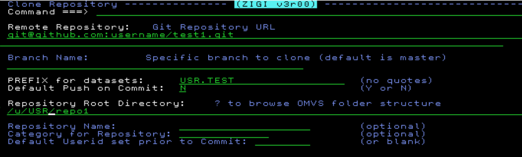
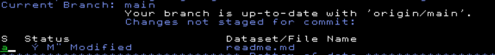
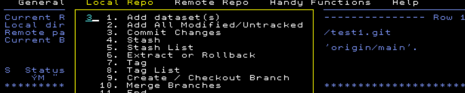
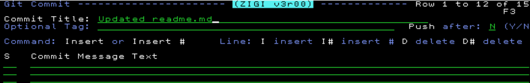
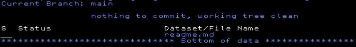
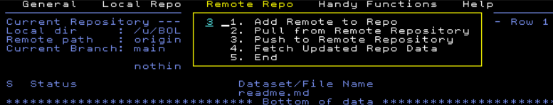
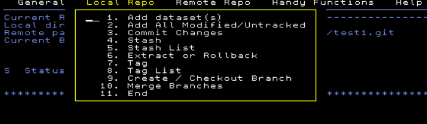
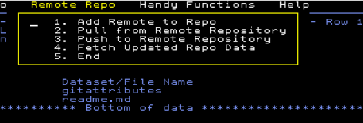

# Zigi

## About

Zigi is a freeware ISPF front-end tool for z/OS Git client. 
Written in REXX, provides user-friendly ISPF interface and transparent usage of native z/OS filesystem 
for handling local repositories.

Using Git with configured webhooks and zigi as ISPF Git client allows automate the code development process 
for mainframes and include it to CI/CD. 

**Link to Zigi github repository:** [https://github.com/wizardofzos/zigi](https://github.com/wizardofzos/zigi)

## Installation

1. Install GIT on z/OS: download and install the Git package from Rocket Software. 
   Go to [https://www.rocketsoftware.com/product-categories/mainframe/git-for-zos](https://www.rocketsoftware.com/product-categories/mainframe/git-for-zos) to get started.
2. From USS run the command to clone zigi-repository:

```
git clone git://github.com/wizardofzos/zigi.git
```

3. Run the script

```
cd zigi
./zginstall.rex
```

## Usage
1. Execute REXX-script ZIGI from ZIGI.EXEC to start working:

 Run command 


 Or using 3.4, browse to the PDS USR.ZIGI.EXEC and enter EX for the member ZIGI, press enter:
 


2. Clone Git-repository to z/Os

Copy SSH-link from Git-repository and fill the fields in the panel:



3. Add to index




4. Commit changes








5. Push changes to remote repository




5. The list of commands for local repository:


6. The list of commands for remote repository:

