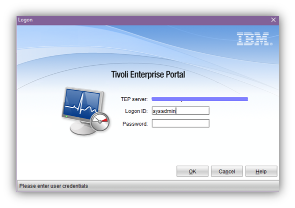
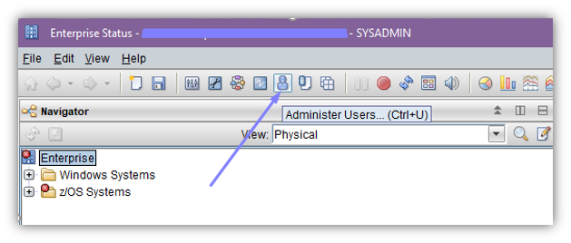
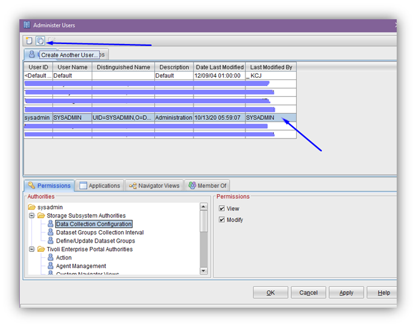
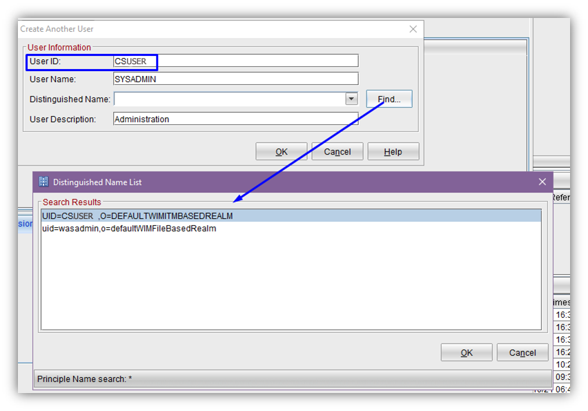
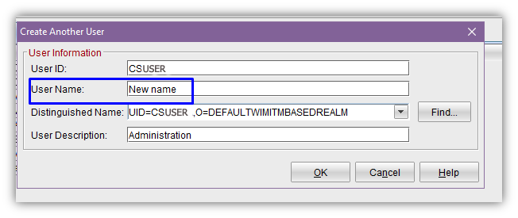
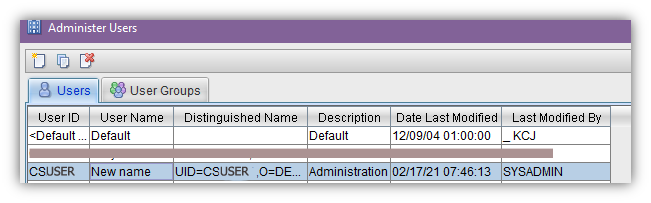

# How to create user in TEP?

1.	For the first start use **sysadmin** for **Logon ID** field:

2.	Select **Administer Users**

3.	Select row with **sysadmin** and press **Create Another user** 

4.	Insert **User ID** which you have for LPAR for z/OS and press **Find**

5.	Select your UID from list and press OK. Change **User Name**.

6.	Press OK. New user is created.

Now you can run TEP using `tso_userID`. Only with `tso_userID` you can create, delete and modify datasets from TEP.