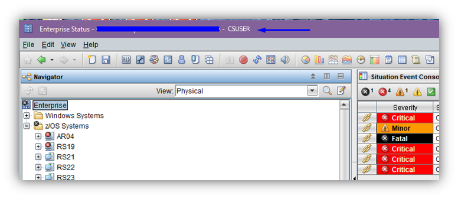
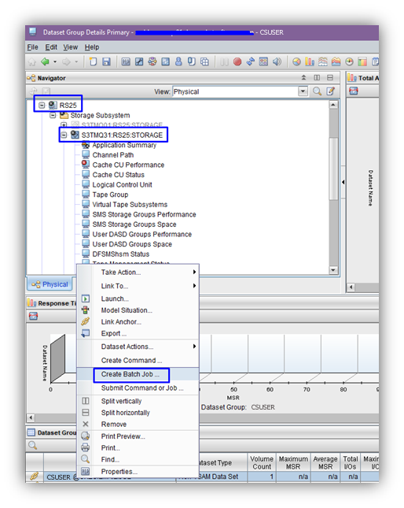
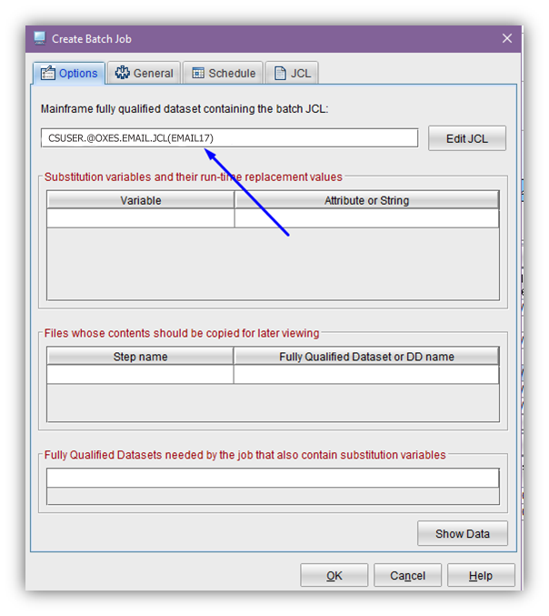
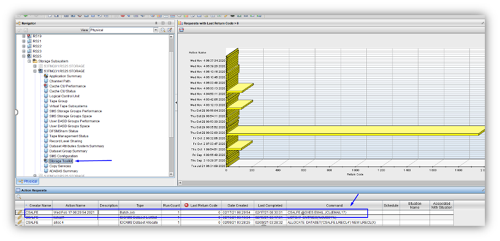

# How to send email using jcl and TEP?

1.	Create jcl like the following:
[http://planetmvs.com/mvsmail/](http://planetmvs.com/mvsmail/) 
```
//* E-MAIL TEMPLATE FOR NOTIFICATIONS 
//EMAILJOB JOB (EMAIL),'EMAIL',         
//      CLASS=A,MSGCLASS=F,                          
//      MSGLEVEL=(1,1),TIME=60,                      
//      NOTIFY=&SYSUID,REGION=0M                     
//SEND     EXEC PGM=IEBGENER                         
//SYSIN    DD DUMMY                                  
//SYSPRINT DD SYSOUT=*                               
//SYSOUT   DD DUMMY                                  
//SYSUT2   DD SYSOUT=(B,SMTP)                        
//SYSUT1   DD *                                      
HELO MVSHOST                                         
MAIL FROM:<USER@HOST.COM>             
RCPT TO:<USER@HOST.COM>               
DATA                                                 
FROM: USER@HOST.COM
TO:   USER@HOST.COM              
SUBJECT: EMAIL_FROM_LPAR1                        
TEXT
/*                                                   
```
If you submit it you will get an email.

2.	Open TEP with `tso_userID`



3.	Select LPAR > Storage Subsystem > AGENT:STORAGE > Dataset Group Summary

Right click on any row and select **Create Batch Job**



4.	Insert jcl location:



5.	Press Edit JCL if you want to change it.
6.	Press OK. It will be submitted.
7.	The result will be placed to **Storage Toolkit** workspace.



Also, you can specify a situation and use Storage Toolkit for an action for it. So jcl will be submitted every time when the situation is triggered.