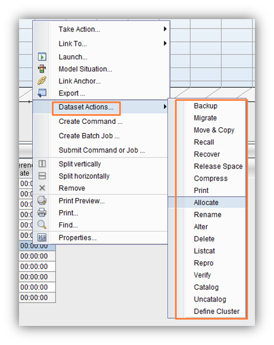
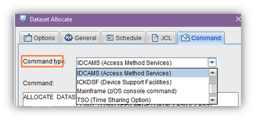
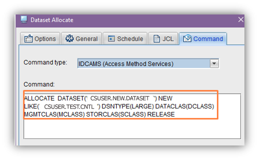
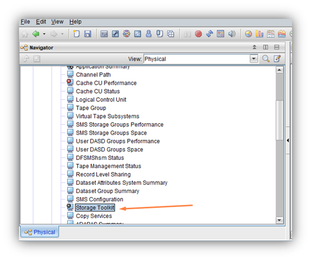
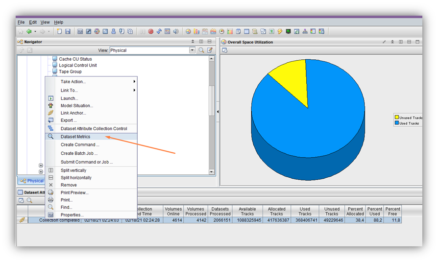
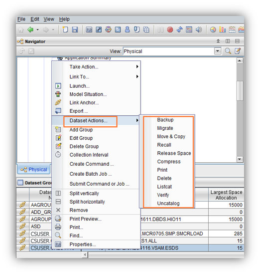

# OMEGAMON for Storage  - modify data sets from TEP

Data sets can be created/deleted/modified from TEP using Storage Toolkit actions.
1.	Run TEP using tso_userID.
2.	Go to one of the following workspaces:

Dataset Group Summary > Dataset Group Primary Datasets **or**

Dataset Attributes System Summary > Dataset Attributes Group Summary > Dataset Attributes Group Details.
3.	Select one of Dataset Actions for any data set:

4.	Select some parameters for action:

5.	Select Command Type

6.	JCL for action will be created. Press OK and JCL will be submitted on LPAR where Storage agent is started.

7.	The result will be placed in Storage Toolkit workspace. Also you can find it in SDSF.

The same actions can be performed using RDM. 

RDM can be run from Dataset Attributes System Summary workspace after collection completed.

Some of that actions can be performed for groups:

