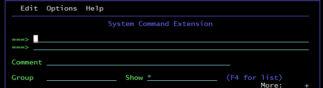

# This document contains various day-to-day and rare SDSF commands.

## Navigation commands and filtering 

| Description |Command| 
|---------|:------------|
| Show all the jobs |``` PRE * ```|
| Show all the jobs with a JOBNAME starting with JOB_NAME   |``` PRE JOB_NAME* ``` |
| Show all the jobs by starting with JOB and ending with NAME   |```PRE JOB%%NAME```  |
| Filter data by owning user ID | `OWNER userid%`|
| Locate a line or column |```LOCATE COLUMN_NAME```  |
| Find a string A |```FIND A```  |
| View a SDSF user/Owner |```WHO``` |
| Show abended jobs |```FILTER MAX AB*```  |
| Show all jobs that ended with JCL error |```FILTER MAX ‘JCL ERROR’```  |
| Show jobs with exceptional conditions |```FILTER MAX NE ‘RC 0000’```  |
| Show successfully completed jobs |```FILTER MAX EQ ‘RC 0000’```  |
| Cancel all filters and show all jobs |```FILTER OFF```  |

## Printing 
Issue a line command ‘XDC‘ against the Job you want to copy in a dataset. You need to give the name of the dataset where you want to store the information.
Suppose, you do not want to capture the entire spool output of the JCL but wish to only store the information of JESYSMSG or JESJCL or JESMSGLG, then you can just give ‘XDC’ in front of JESYSMSG or JESJCL or JESMSGLG respectively.

| Description |Command| 
|---------|:------------|
| Prints to a data set and closes the print file when the printing is done. Write this command on the left of JOBNAME | ```XDC``` |
| Prints the output that you are browsing. This command entered from within browse | ```PRINT``` |

## Control cursor placement 

| Description |Command| 
|---------|:------------|
| Keep the cursor on the row you are working with | ```SET CURSOR ON``` |
| Return cursor to thecommand line | ```SET CURSOR TOP``` |
| Scroll the log to the bottom every 15 seconds | ```BOT &15``` |

## How to see the jobs in Input Queue?
In order to check the jobs present in the Input queue, you need to give option ‘I’ in the command input

| Description |Command| 
|---------|:------------|
| Check for all the jobs with the class A and C in Input Queue which are on hold | ```IAC H``` |
| Check for all the jobs with the class A in Input Queue which are not on hold in   |```IA NH```  |

## How to run a JCL directly from SPOOL area?
Issue a line command ‘SJ‘ against the job you wish to run. You can edit the JCL here and submit it.
Please note that editing of JCL here does not save the changes in the member where your JCL is present so you cannot physically SAVE the changes but only logical editing can be done.

| Description |Command| 
|---------|:------------|
| Run a JCL directly from SPOOL area | ```SJ``` |

## How to dynamically authorize a library (APF)?
To authorize a library use the following commands from SDSF:

1. For open “System Command Extension” use:   `/+` 



Now a very long command can be entered. It is useful if the library name is too long.

2. `SETPROG APF,add,library=LIBNAME.QA.MODL,volume=VOLNAME`