# What should you do if RECEIVE ends with RC=12?

Sometimes during SMP/e installing RECEIVE step can end with RC=12 and the following message:
```
GIM44013I    SYSTEM ABENO E37 OCCURRED WITH A REASON CODE OF '00000004'x AFTER S
             SMPPTS LIBRARY RAN OUT OF SPACE. THE LIBRARY IS NOT ELIGIBLE FOR RE
GIM48300S ** SYSMOD  sysmod COULD NOT BE SAVED IN THE SMPPTS LIBRARY BECAUSE IT 
GIM24801W    NO SYSMODS SATISFIED THE OPERANDS SPECIFIED ON THE RECEIVE COMMAND.
GIM20501I    RECEIVE PROCESSING IS COMPLETE. THZ HIGHEST RETURN CODE WAS 12.    

GIM20502I    SMP/E PROCESSING IS COMPLETE. THE HIGHEST RETURN COOE WAS 12
```

This happens because SMPPTS library ran out of space. So, you need to recreate it with grater space.

## Step 1. Find out SMPPTS library name

Go to **3.4** (DSLIST utility) and select your CSI

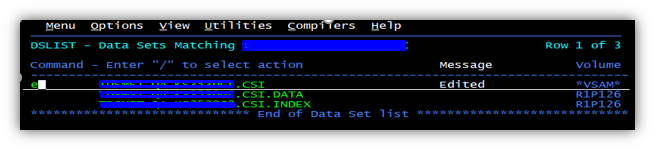

Now you know SMPPTS library name

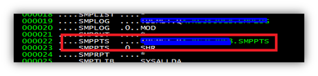

## Step 2. Create new SMPPTS library

Use **3.2** option (Data Set utility) 

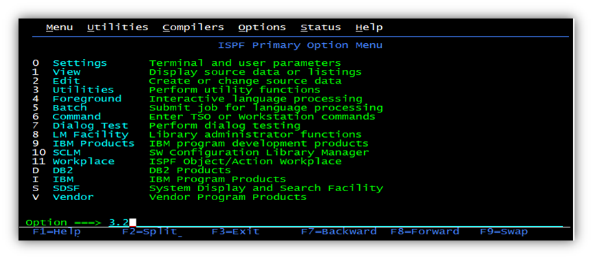

Enter current SMPPTS name

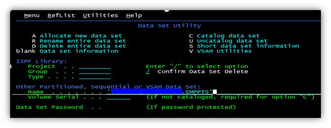

Press Enter and you will see Data Set Information

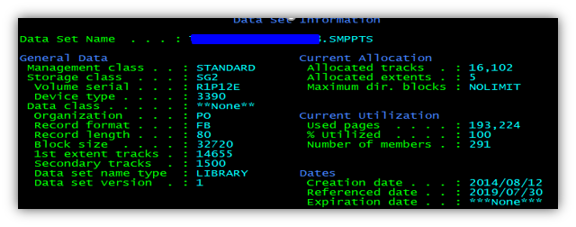

Press F3 and then enter new name and select “A” for allocate option

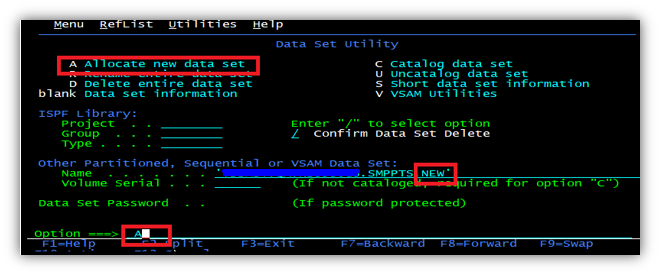

You will see the same parameters for new library. You need to change **Primary quantity** and **Secondary quantity** to do they bigger.

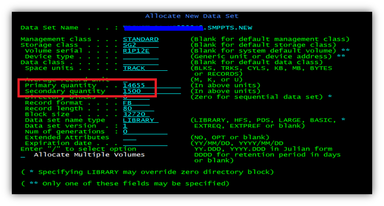

## Step 3. Copy members from the current library to the new library

* 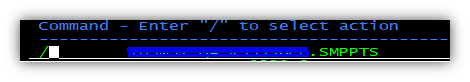

* 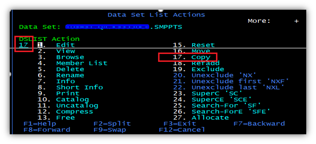

* 

* 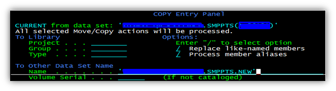

## Step 4. Rename libraries

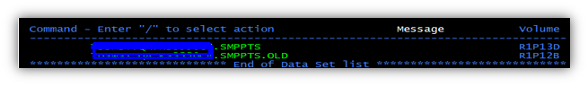

Now, you have SMPPTS library with the same name but bigger space. So, RECEIVE should end with RC=0.
