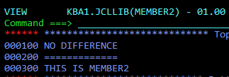
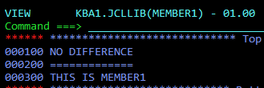
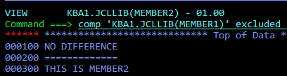
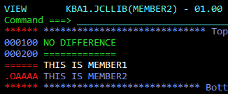

# How to compare two data sets interactively?
It is possible to compare two non-VSAM datasets interactively. 

	1. Go to one of the datasets in `edit` or `view` mode
	2. Enter the command:
	
```
comp '#name of another dataset' excluded 
```

For instance, there are two datasets that differ in only one record.





Enter the command



We get the result

