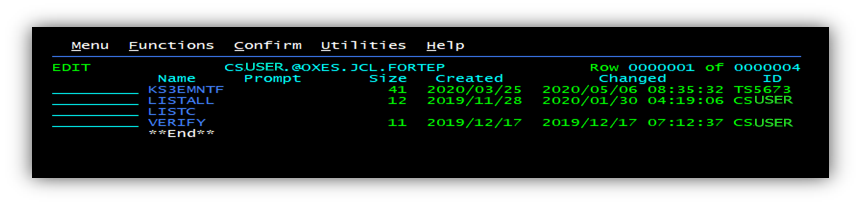
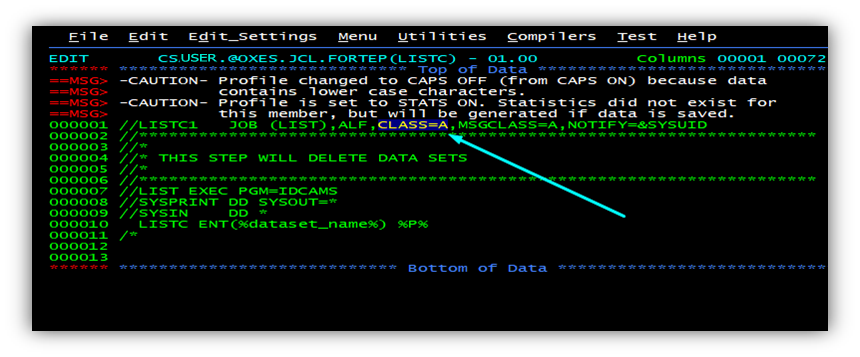
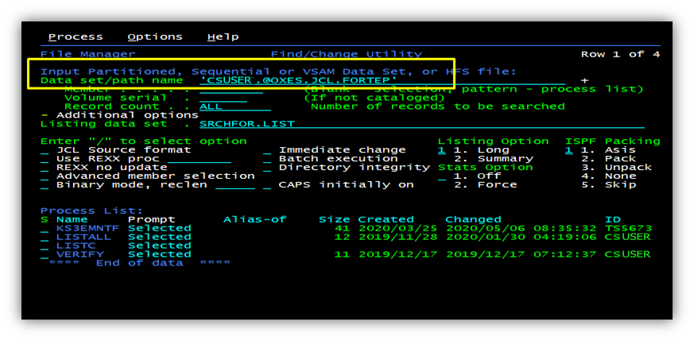
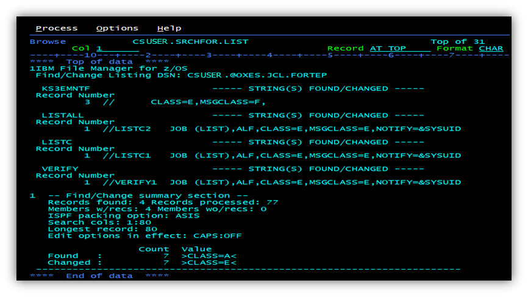
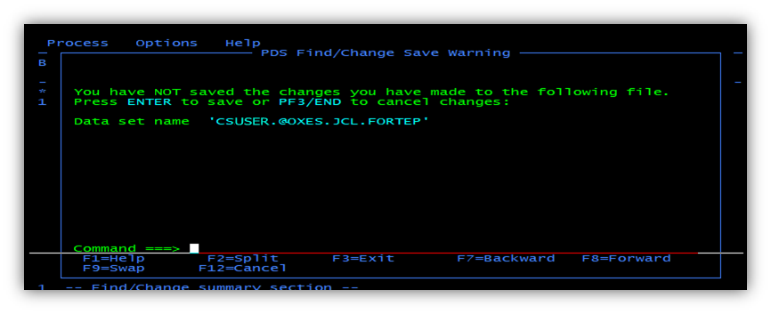
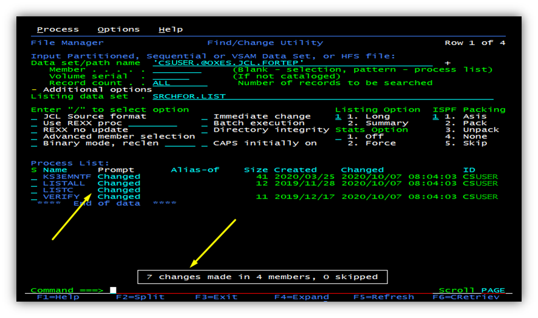
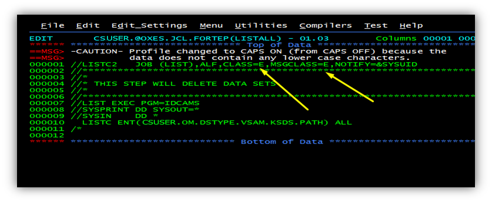

# How to do some changes in each member of PDS?

For example we have some PDS with members like this:



And we need to change `CLASS=A` to `CLASS=E` in each of them.



From ISPF Primary Option Menu select **FMN** (File manager) and then **3.6**

Specify PDS and members:



In the command line type: 
```
c 'CLASS=A' 'CLASS=E'
```

Press **Enter**. You will see all changes:



Press **F3**



Press **Enter** to complete



The result:

