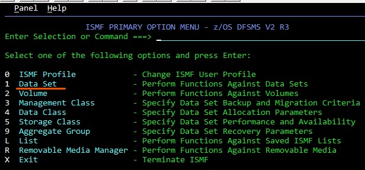
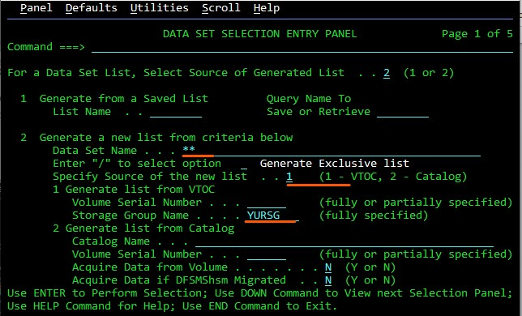
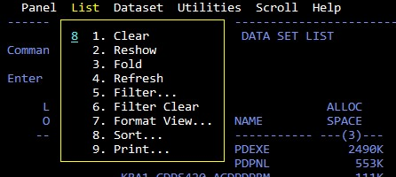
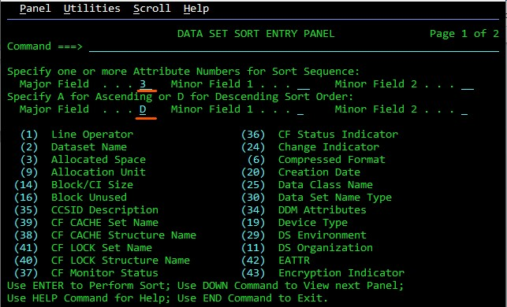

# How to find out which data sets have used the most amount of space?

Suppose you want to find large objects. We will do this using the standard utility ISMF (Integrated Storage Management Facility)

1.	Open  ISMF 
2.	Select the "Data set" menu item

 
3.	Here set the following parameters:
    * Data Set Name - **\*\***
    * Source of the new list – **1** (VTOC)
    * Storage Group Name – your Storage Group
    

 
4.	Above, in the action bar, select List – 8 (Sort) 

 
5.	Set the following parameters:
    * Major Field – **3** (Allocated space)
    * Major Field – **D** (In descending order)
    

 
6.	You can now see the data sets that are consuming the most amount of memory
