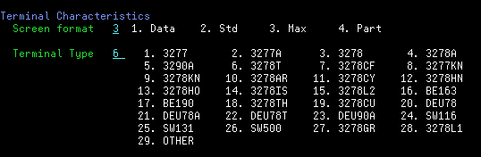
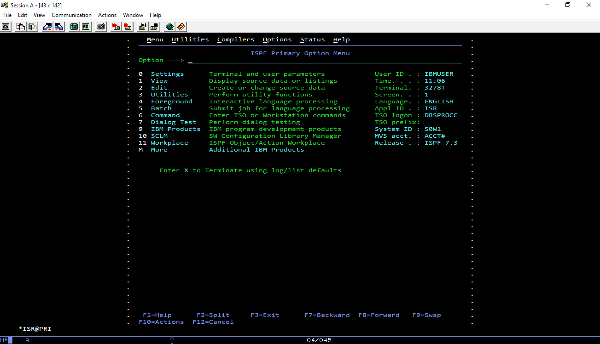

# How to use 3270 emulators with larger screensize?
1. Open ***.WS** file and update:
    * in [Telnet3270] section **add** 
    ```
    TerminalTypeString=IBM-DYNAMIC
    ```
        
    *  In [3270] section **modify**
    ```
    ScreenSize=43x142
    ```
2)	Run your session and enter ISPF
3)	Enter option Terminal and user parameters (option 0)
Set Screen format   3 (3278)
Set Terminal Type   6 (3278T)


4)	The screen should be 
